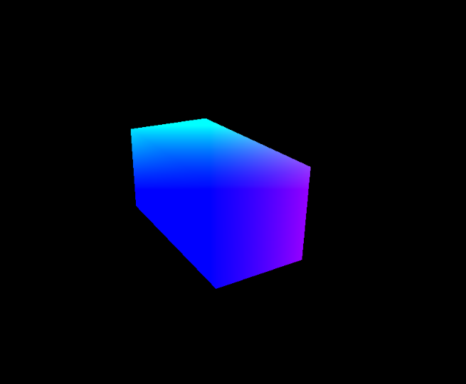

# threejs-cuboid-shader

A lightweight WebGL project using Three.js and GLSL to render a real-time, shader-lit 3D cuboid. Implements custom vertex and fragment shaders to apply dynamic surface color based on transformed vertex position — a minimal simulation of directional shading.

---

## Overview

This project renders a spinning 3D cuboid in a browser using Three.js. Custom vertex and fragment shaders (written inline in JavaScript) apply a simple diffuse shading effect based on transformed vertex positions.

---

## Technologies Stack

- Three.js (WebGL wrapper)
- GLSL (OpenGL Shading Language)
- JavaScript / HTML

---

## Files

- `cuboid-shader.html`: Main HTML/JavaScript file. Includes:
  - Scene and camera setup
  - Cuboid geometry creation (`THREE.BoxGeometry`)
  - Inline custom GLSL shaders (as JS template strings)
  - Animation loop using `requestAnimationFrame()`

> Note: All GLSL shader logic is embedded directly inside `cuboid-shader.html` using JavaScript template literals.

---

##

> Cuboid color is dynamically computed using vertex position as RGB input — a basic lighting proxy.

---

## Features

- Real-time rotation using `requestAnimationFrame()`
- Inline vertex & fragment shaders using `ShaderMaterial`
- Custom position-based surface coloring (GLSL-driven)
- Color shading driven by vertex position, simulates basic directional coloring.

---

## Running the Code

Open `cuboid-shader.html` in any modern browser (Chrome, Firefox). No server needed.

---
